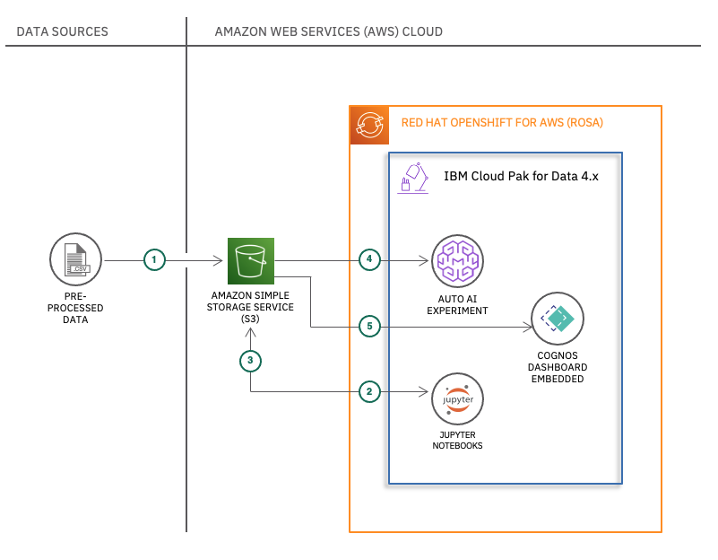
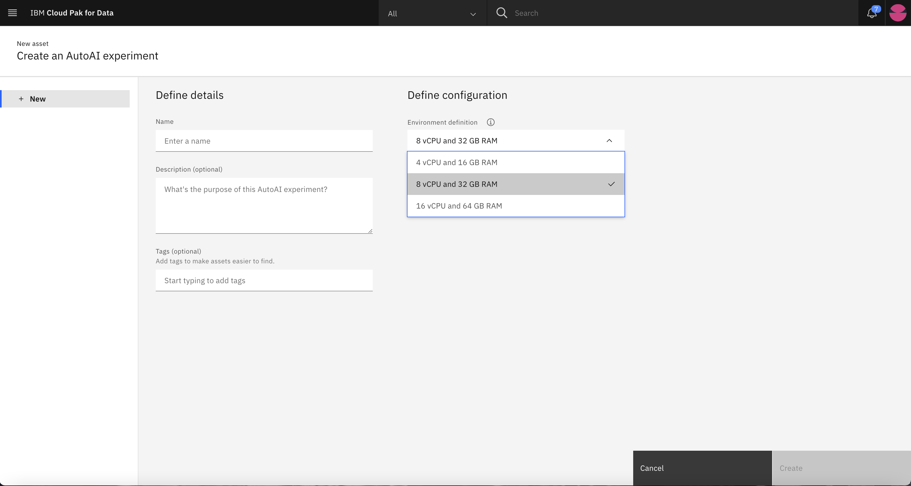
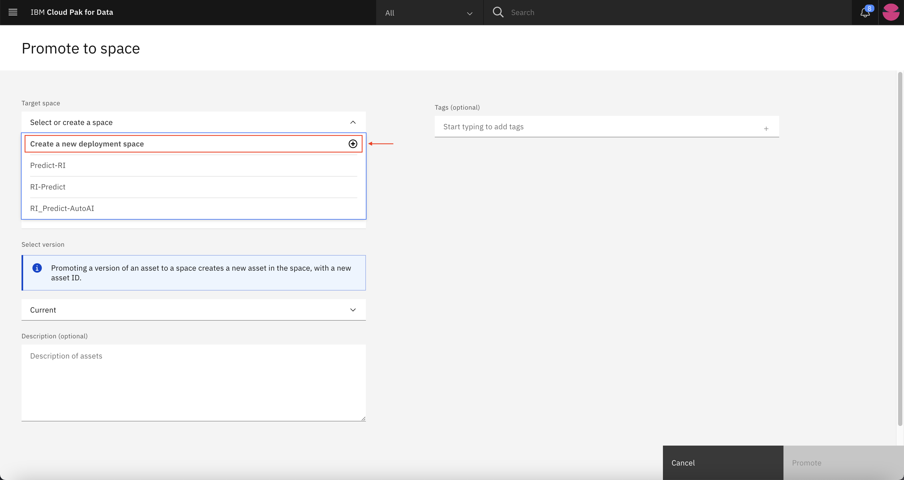
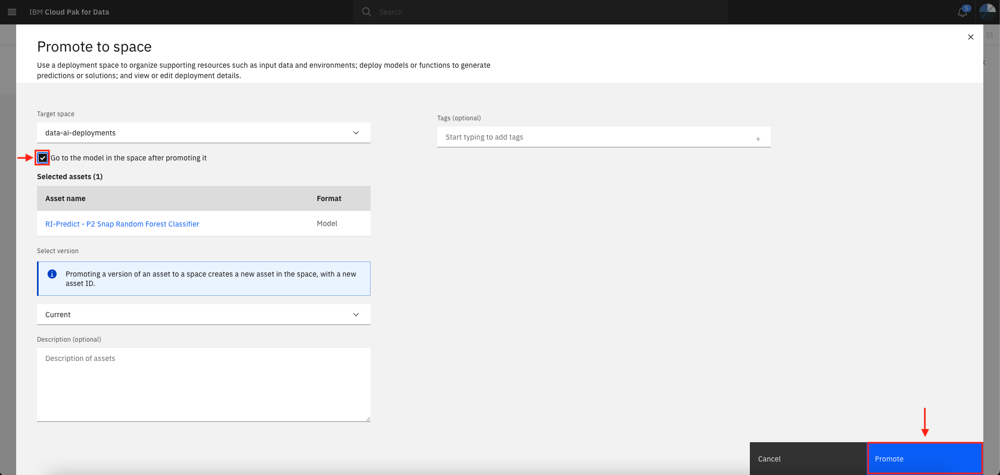
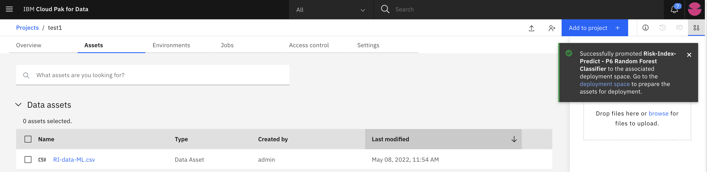
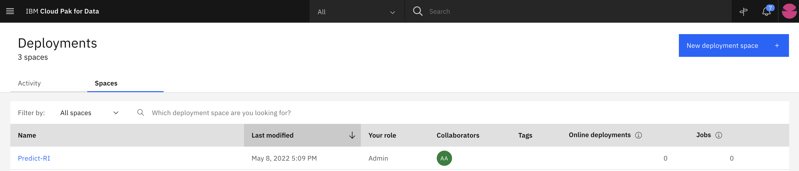
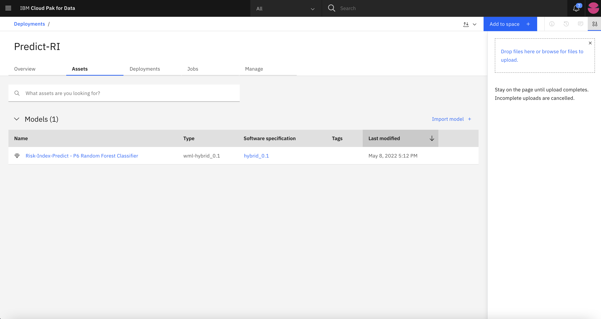
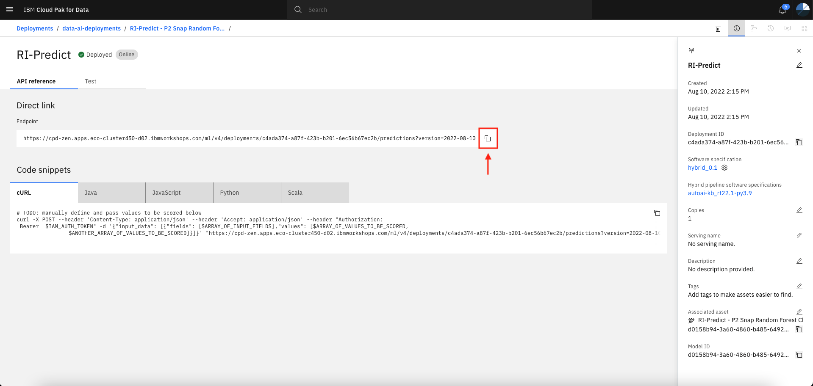
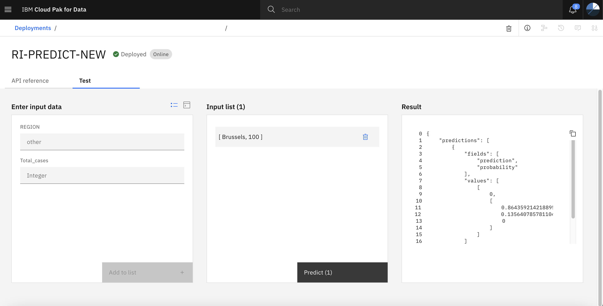

# Build machine learning models with code/no code in a collaborative data science environment

In this code pattern, you will build time-series machine learning models and visualize the results using IBM Cloud Pak for Data Jupyter Notebooks, AutoAI and Embedded Dashboard on Amazon Web Services (AWS) Cloud. Developers will learn both **Code** and **No Code** approach to build models and visualize the results.  

When you have completed this code pattern, you will understand how to:

* Build state of the art Long Short Term Memory(LSTM) prediction models using IBM Cloud Pak for Data Jupyter Notebook
* Visualize the actual vs predicted values in IBM Cloud Pak for Data Cognos Dashboard Embedded
* Build and compare different predictive models with ‘No code approach’ in IBM Cloud Pak for Data using Watson AutoAI Experiments

## Flow

1. Pre-processed datasets are loaded into an Amazon S3 bucket
2. The datasets from the S3 bucket are read in Jupyter Notebooks
3. Different models are built and evaluated in Jupyter Notebooks and the final prediction data is stored back into S3 bucket
4. The datasets from the S3 bucket is copied into Watson Studio Project and loaded into AutoAI. Different models are built and compared in AutoAI with no code
5. The prediction data produced by the Jupyter Notebook models stored in S3 bucket is read by Cognos Dashboard Embedded to visualize the data in the form of interactive dashboard  

<!--Optionally, update this section when the video is created-->
## Watch the Video

Coming soon!

# Steps

1. [Setup a S3 Bucket](#1-setup-a-s3-bucket)
2. [Setup a project in Cloud Pak for Data](#2-setup-a-project-in-cloud-pak-for-data)
    * 2.1. [Create a Project](#21-create-a-project)
    * 2.2. [Create a Connection to S3](#22-create-a-connection-to-s3)
3. [Code Approach: Build Prediction Models with Watson Studio](#3-code-approach-build-prediction-models-with-watson-studio)
    * 3.1. [About the Notebooks](#31-about-the-notebooks)
    * 3.2. [Run LSTM Notebook 1](#32-notebook-1--predict-future-covid-19-cases-for-brussels-region-with-long-short-term-memory-lstm-model)
    * 3.3. [Run LSTM Notebook 2](#33-notebook-2--predict-future-covid-19-cases-for-wallonia-region-with-long-short-term-memory-lstm-model)
    * 3.4. [Run Decision Tree Notebook](#34-notebook-3--risk-index-prediction-with-decision-tree)

4. [No Code Approach : Build Prediction Models with IBM Cloud Pak for Data using AutoAI](#4-no-code-approach-build-prediction-models-with-ibm-cloud-pak-for-data-using-autoai)
5. [Visualize the Predictions in IBM Cloud Pak for Data Cognos Embedded Dashboard](#5-visualize-the-predictions-in-ibm-cloud-pak-for-data-cognos-embedded-dashboard)

    * 5.1. [Setup Cognos Embedded Dashboard](#51-setup-cognos-embedded-dashboard)
    * 5.2. [Analyze Cognos Embedded Dashboard](#52-analyze-cognos-embedded-dashboard)

## 1. Setup a S3 Bucket

### 1.1. Create a S3 Bucket

Create a S3 bucket in AWS by refering to the AWS documentation.

* [Creating a bucket](https://docs.aws.amazon.com/AmazonS3/latest/userguide/create-bucket-overview.html)
* Click on Create Bucket and enter a name for the bucket. (for example, 'lab4')
* Keep the `Block all public access` enabled and then click on `Create bucket` button.

### 1.2. Upload data to s3 bucket

* Sign in to the AWS Management Console and open the Amazon S3 console at <https://console.aws.amazon.com/s3/>
  * In the Buckets list, choose the name of the bucket that you created.(for example, 'lab4')
  * Click on **Upload**, select **Add files** and upload the following files:
    * [ts-Brussels-grouped.csv](data/ts-Brussels-grouped.csv)
    * [ts-Wallonia-grouped.csv](data/ts-Wallonia-grouped.csv)
  * Click on **Upload**.

## 2. Setup a project in Cloud Pak for Data

### 2.1. Create a Project

* Create a project in IBM Cloud Pak for Data. Click on the **Hamburger** menu, and select **All Projects**.

  

* Click on **New Project**.
  * Select project type as **Analytics project**.
  * Click on **Create a project from file**.
  * Upload the **[cpd-project.zip](project/cpd-project.zip)** file.
  * Enter a project name and click on **Create**.

* Once the project is created click on **View Project**. You should see the overview of the project as shown below.

  

* Click on the **Assets** tab and you will see **Notebooks** and **Dashboards**.

### 2.2. Create a Connection to S3

* Click on **Add to Project** and select **Connection**.
* Select Connection type as **Amazon S3**.
  * Enter the credentials to connect to your S3 bucket.
  * Click on **Test connection** and you will see connection successful message if you have entered the correct credentials
  * Click on **Create**.

  

* Once the connection is created, you will see the connection in Assets tab under **Data assets**. With this connection you can access all the datasets present in your S3 bucket from your Cloud Pak for Data project.

## 3. Code Approach: Build Prediction Models with Watson Studio

In the Code Approach you will learn how to build two types of prediction models in Watson Studio Jupyter Notebooks. As a Developer you will have full control over the model’s hyperparameters and the training data in this section.

The section is divided into following sub-sections:

* 3.1. [About the Notebooks](#31-about-the-notebooks)
* 3.2. [Run LSTM Notebook 1](#32-notebook-1--predict-future-covid-19-cases-for-brussels-region-with-long-short-term-memory-lstm-model)
* 3.3. [Run LSTM Notebook 2](#33-notebook-2--predict-future-covid-19-cases-for-wallonia-region-with-long-short-term-memory-lstm-model)
* 3.4. [Run Decision Tree Notebook](#34-notebook-3--risk-index-prediction-with-decision-tree)

### 3.1. About the Notebooks

* Click on the **Assets** tab and you will see the following **Notebooks**:
  * **Region-Brussels-LSTM.ipynb**
  * **Region-Wallonia-LSTM.ipynb**
  * **Region-All-Decision-Trees.ipynb**
  
* The LSTM notebooks are used to build the prediction models to predict future COVID-19 cases for Brussels and Wallonia region respectively. LSTM models are built using the data from the datasets in the S3 bucket. Both the models are built with different hyperparameters.

* LSTM Model for **Brussels** region is built with the following hyperparameters:
  * **train_test_split:** `0.70`
  * **lookback:** `30`
  * **hidden_layers:** `2`
  * **units:** `55`, `100`
  * **dropouts:** `0.15`, `0.15`
  * **optimizer:** `adam`
  * **learning_rate:** `0.001` (default)
  * **epochs:** `25`
  * **batch_size:** `32`

* LSTM Model for **Wallonia** region is built with the following hyperparameters:
  * **train_test_split:** `0.70`
  * **lookback:** `30`
  * **hidden_layers:** `2`
  * **units:** `60`, `100`
  * **dropouts:** `0.15`, `0.15`
  * **optimizer:** `adam`
  * **learning_rate:** `0.001` (default)
  * **epochs:** `25`
  * **batch_size:** `32`

* Aditionally, Decision Tree notebook is used to build a model to predict the Risk Index for Brussels, Flanders and Wallonia region.

* Decision Tree models are built with the following hyperparameters:
  * **train_test_split:** `0.70`
  * **max_depth:** `4`
  * **min_samples_split:** `2`
  * **min_samples_leaf:** `1`
  * **criterion:** `entropy`

### 3.2. Notebook 1 : Predict future COVID-19 cases for Brussels region with Long Short-Term Memory (LSTM) Model

In this lab exercise, you will learn a popular opensource machine learning algorithm, Long Short-Term Memory (LSTM). You will use this time-series algorithm to build a model from historical data of total COVID-19 cases. Then you use the trained model to predict the future COVID-19 cases.

* You will refer to the **Region-Brussels-LSTM.ipynb** notebook.

* Click on the **edit** button to open the notebook in edit mode.

  

* The notebook should look something as shown below.

  

* Before running the notebook, you need to add the S3 connection to the notebook.
  * Click on the third code cell in the notebook.
  * Click on **find and add data** button on top right.
  * Click on **Connections** tab.
  * You will see your connection variable. Click on **Insert to code** and select **pandas DataFrame**.
  * Select the **ts-brussels-grouped.csv** dataset from the connection variable.

  

* Verify the dataframe name to be `data_df_1` in the generated code snippet.

* Click on **Cell** and select **Run All** to run the notebook.

  

* This will run the notebook, it will take some time please be patient.

* Once the notebook is completed you can observe the following in the notebook:
  * **Current Trend of COVID-19 cases in Brussels**
  * **LSTM Model Accuracy**
  * **LSTM Model Loss**
  * **LSTM Model Prediction**

* **Current Trend of COVID-19 cases in Brussels:** The current trend of COVID-19 cases in Brussels is shown in the graph.

  

* **LSTM Model Accuracy:** You can observe the Root Mean Squared Error (RMSE) values are almost similar for training & test data which confirms the accuracy of the model without overfitting or underfitting.

  

* **LSTM Model Loss:** There's no vanishing gradient descent as the LSTM model with optimal configueration has taken care of the gradient descent problem.

  

* **LSTM Model Prediction:** You can observe the model is able to catch the pattern in the data.

  

* The following CSV files are generated from the notebook:
  * **Brussels.csv:** This is the dataframe containing the historical COVID-19 cases in Brussels.
  * **brussels-actualVsPredicted.csv:** This is the dataframe containing the actual and predicted COVID-19 cases in Brussels.
  * **brussels-errorEvaluation.csv:** This is the dataframe containing the error evaluation of the model.
  * **brussels-next7Prediction.csv:** This is the dataframe containing the next 7 days prediction of COVID-19 cases in Brussels.

* These CSV files will be stored to your S3 bucket and Data Assets in your Cloud Pak for Data project.

>Note: These CSV files will be used to Visualize the Data in Watson Cognos Dashboard Embedded

You have successfully completed this lab exercise. You can continue to the next lab exercise.

### 3.3. Notebook 2 : Predict future COVID-19 cases for Wallonia region with Long Short-Term Memory (LSTM) Model

In this lab exercise, you will learn a popular opensource machine learning algorithm, Long Short-Term Memory (LSTM). You will use this time-series algorithm to build a model from historical data of total COVID-19 cases. Then you use the trained model to predict the future COVID-19 cases.

* You will refer to the **Region-Wallonia-LSTM.ipynb** notebook.

* Click on the **edit** button to open the notebook in edit mode.

  

* The notebook should look something as shown below.

  

* Before running the notebook, you need to add the S3 connection to the notebook.
  * Click on the third code cell in the notebook.
  * Click on **find and add data** button on top right.
  * Click on **Connections** tab.
  * You will see your connection variable. Click on **Insert to code** and select **pandas DataFrame**.
  * Select the **ts-wallonia-grouped.csv** dataset from the connection variable.

  

* Verify the dataframe name to be `data_df_1` in the generated code snippet.

* Click on **Cell** and select **Run All** to run the notebook.

  

* This will run the notebook, it will take some time please be patient.

* Once the notebook is completed you can observe the following in the notebook:
  * **Current Trend of COVID-19 cases in Brussels**
  * **LSTM Model Accuracy**
  * **LSTM Model Loss**
  * **LSTM Model Prediction**

* **Current Trend of COVID-19 cases in Brussels:** The current trend of COVID-19 cases in Brussels is shown in the graph.

  

* **LSTM Model Accuracy:** You can observe the Root Mean Squared Error (RMSE) values are almost similar for training & test data which confirms the accuracy of the model without overfitting or underfitting.

  

* **LSTM Model Loss:** There's no vanishing gradient descent as the LSTM model with optimal configueration has taken care of the gradient descent problem.

  

* **LSTM Model Prediction:** You can observe the model is able to catch the pattern in the data.

  

* The following CSV files are generated from the notebook:
  * **Wallonia.csv:** This is the dataframe containing the historical COVID-19 cases in Wallonia.
  * **wallonia-actualVsPredicted.csv:** This is the dataframe containing the actual and predicted COVID-19 cases in Wallonia.
  * **wallonia-errorEvaluation.csv:** This is the dataframe containing the error evaluation of the model.
  * **wallonia-next7Prediction.csv:** This is the dataframe containing the next 7 days prediction of COVID-19 cases in Wallonia.

* These CSV files will be stored to your S3 bucket and Data Assets in your Cloud Pak for Data project.

>Note: These CSV files will be used to Visualize the Data in Watson Cognos Dashboard Embedded

You have successfully completed this lab exercise. You can continue to the next lab exercise.

### 3.4. Notebook 3 : Risk Index Prediction with Decision Tree

In this lab exercise, you will learn a popular machine learning algorithm, Decision Tree. You will use this classification algorithm to build a model from historical data of region and their total cases. Then you use the trained decision tree to predict the Risk Index of a region.

* You will refer to the **Region-All-Decision-Tree.ipynb** notebook.

* Click on the **edit** button to open the notebook in edit mode.

  

* The notebook should look something as shown below.

  

* Before running the notebook, you need to add the S3 connection to the notebook.
  * Click on the third code cell in the notebook.
  * Click on **find and add data** button on top right.
  * Click on **Connections** tab.
  * You will see your connection variable. Click on **Insert to code** and select **pandas DataFrame**.
  * Select the **RI-data-ML.csv** dataset from the connection variable.

  

* Verify the dataframe name to be `data_df_1` in the generated code snippet.

* Click on **Cell** and select **Run All** to run the notebook.

  

* This will run the notebook, it will take some time please be patient.

* Once the notebook is completed you can observe the following in the notebook:
  * **Decision Tree Model Accuracy**
  * **Decision Tree Visualization**

* **Decision Tree Model Accuracy:** You can observe the accuracy of the model is 86.63%.

  

* **Decision Tree Visualization:** You can observe the decision tree in the notebook.

  

You have successfully completed this lab exercise.

>Note: Next steps - [Visualize the Data in Cognos Embedded Dashboard](/020_start-the-lab/visualize/)

## 4. No Code Approach: Build Prediction Models with IBM Cloud Pak for Data using AutoAI

This section demonstrates how to build AI models without any code. After the project is created in step 2.1, click on Add to project option on top right and select AutoAI experiment as asset type.

Create an AutoAI experiment by giving it a name & select the environment definition as 8vCPU and 32GB RAM.

Add the data file by selecting Browse or Select from project. Select the [RI-data-ML.csv](data/RI-data-ML.csv) file from the project.

Click on Select from project and select the data asset as shown below.

Click on 'No' for creating a time series forecast. We are building a multi class classifier. Select Risk_Index as the option to predict and hit Run experiment.

It will take a couple of minutes to complete the experiment. You will see Experiment completed on the right side of the canvas.

Review the eight pipelines generated per below.

Click on first pipeline (Rank 1) and choose Save as option on the top right hand side.

Click on Save as Model and hit create.

We should see the message Model saved successfully per below. Click on View in project option.

Click on View in project option and select Promote to deployment space.

Under Target space, select or create a new deployment option. Lets create a new deployment.

Give a name to the deployment and hit create.

The deployment space gets created in a minute.

We need to promote the deployment by clicking on Promote at the bottom right corner.

We should see a message stating successfully promoted the model to the deployment space.

Click on the **Hamburger** menu, and select Deployments.

Click on Predict-RI deployment which was created a couple of steps back.

Click on Assets and click on the Random Forest Classifier model.

Click on New deployment.

Select Deployment type as Online, give a name to the deployment and hit Create.

It will take a couple of minutes for the deployment. The status should be Deployed per below.

Click on model-deploy and you should see the Endpoint and Code Snippets per below.

Lets do some predictions. Click on Test option and input the data using form or Json format.

Enter the input data using single or multiple samples (Json). We will try with single sample by giving the input to Region as Brussels & 100 as Total_cases and click on Add to list.

You should see the Input list updated with the sample values. Hit Predict to generate predictions.

We can see the predicted value is 1 under Result section which means the risk index is predicted as Low for the input data of Brussels Region with 100 cases on a given day.

We have learnt how to build AI predictive models without any code, deploy the model and generate predictions. Feel free to play around to get comfortable using AutoAI for generating accurate predictions.

## 5. Visualize the Predictions in IBM Cloud Pak for Data Cognos Embedded Dashboard

In this section, you will learn how to build responsive data visualization in Watson Studio's Cognos Embedded Dashboard. You can build interactive charts, tables, graphs, etc in the Cognos Embedded Dashboard. You will use the data generated in the previous lab exercise to build the following visualizations:

* Current trends and future prediction of COVID-19 cases region wise.
* Model evaluation metrices such as actual vs predicted cases and model loss region wise.

The section is divided into following sub-sections:
  
* 5.1. [Setup Cognos Embedded Dashboard](#51-setup-cognos-embedded-dashboard)
* 5.2. [Analyze Cognos Embedded Dashboard](#52-analyze-cognos-embedded-dashboard)

### 5.1. Setup Cognos Embedded Dashboard

#### Create a new Cognos Embedded Dashboard

* Before you get started, download the [Covid-19-predictions-dashboard.zip](/dashboard/Covid-19-predictions-dashboard.zip) dashboard file and extract the zip file.

* In the Cloud Pak for Data project, click on **Add to Project** and select asset type as **Dashboard**.

* Select create a new dashboard from **Local file**.
  * Upload the `Covid-19-Predictions-Dashboard.json` extracted file.
  * Enter a **name** for the dashboard.
  * Click on **Create**.

#### Relink Data Assets to the Dashboard

* Once the dashboard is created, you will see a message saying **Missing data asset (1/8)**.

* To relink the missing data assets, do the following:
  * Click on Relink.
  * Select **Data Assets** and select the dataset.
  * Link the following data assets:
    * **Brussels.csv**
    * **brussels-next7Prediction.csv**
    * **wallonia-next7Prediction.csv**
    * **brussels-actualVsPredicted.csv**
    * **brussels-errorEvaluation.csv**
    * **wallonia-actualVsPredicted.csv**
    * **wallonia-errorEvaluation.csv**
    * **Wallonia.csv**

Once all the assets are relinked, you will see the dashboard view as shown.

More about the dashboard is explained in the next section.

### 5.2. Analyze Cognos Embedded Dashboard

There are two tabs in the Dashboard **Trends** and **Model Evaluation**.

* **Trends** Tab has the following widgets for the Brussels and Wallonia regions:

  * **Total Cases:** Shows the total number of cases for the Region.
  * **Region Map:** Shows the map of the Region.
  * **Current Trends:** Shows the current trends for the Region.
  * **7 Days Prediction:** Shows the 7 days prediction for the Region.

* **Model Evaluation** Tab has the following widgets for the Brussels and Wallonia regions:

  * **Actual vs Predicted:** Shows the actual vs predicted values for the model of the perticular Region.
  * **Model Loss:** Shows the model loss for the model of the perticular Region.

The Dashboard is interactive, you can click on any data point from the dashboard to see the details change in realtime.

## Summary

In this code pattern, you learn't how to build time-series and decision tree machine learning models on IBM Cloud Pak for Data Jupyter Notebooks and visualize the results on IBM Cloud Pak for Data Embedded Dashboard on Amazon Web Services (AWS) Cloud with **Code Approach**. You also learnt how to build models and deploy them with AutoAI under **No Code Approach**.

<!-- keep this -->
## License

This code pattern is licensed under the Apache License, Version 2. Separate third-party code objects invoked within this code pattern are licensed by their respective providers pursuant to their own separate licenses. Contributions are subject to the [Developer Certificate of Origin, Version 1.1](https://developercertificate.org/) and the [Apache License, Version 2](https://www.apache.org/licenses/LICENSE-2.0.txt).

[Apache License FAQ](https://www.apache.org/foundation/license-faq.html#WhatDoesItMEAN)
